# Case Feeder Pro

Firmware for an automatic brass case feeder, a bullet feeder, or both run
side by side from one controller, with a touchscreen to control them.

- **Controller:** BigTreeTech SKR Pico V1.0 (RP2040). It drives the feeder
  motors, watches the part sensors, detects and clears jams, and stores
  the settings.
- **Touchscreen:** LCDWiki ES3C28P 2.8" ESP32-S3 display. It shows each
  feeder's state, speed and rate, sounds alerts, and holds the settings.

## The feeders

### Case feeder

<p>
  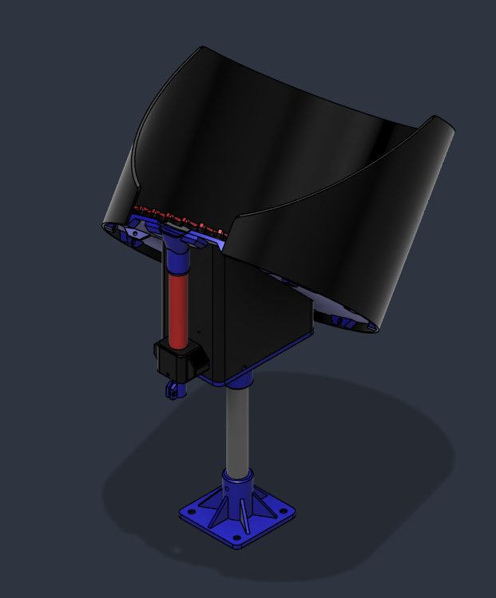
  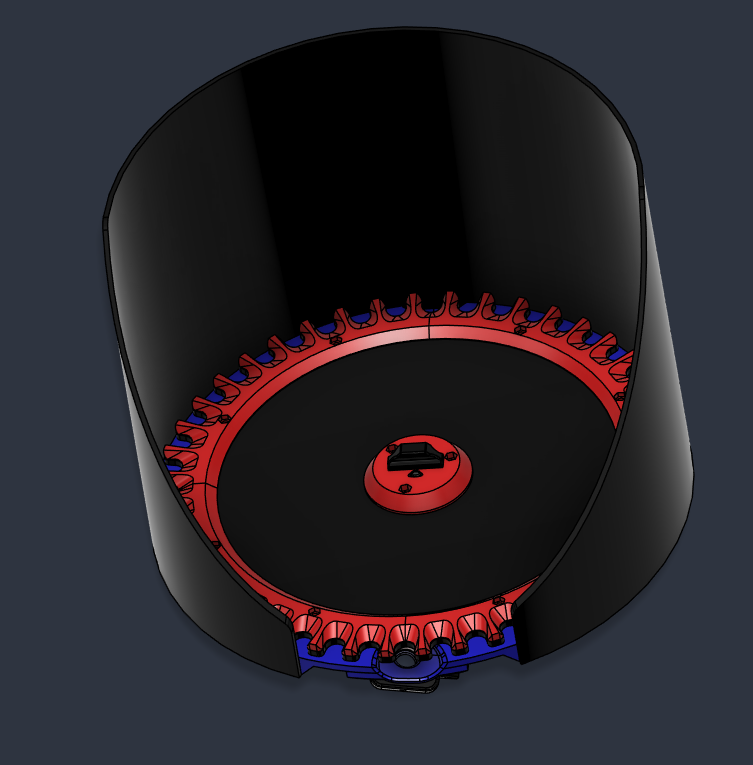
  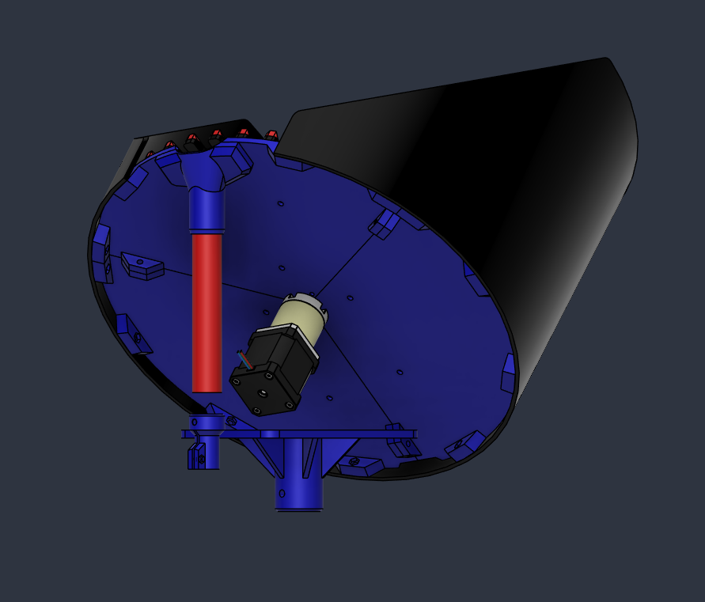
</p>
<p>
  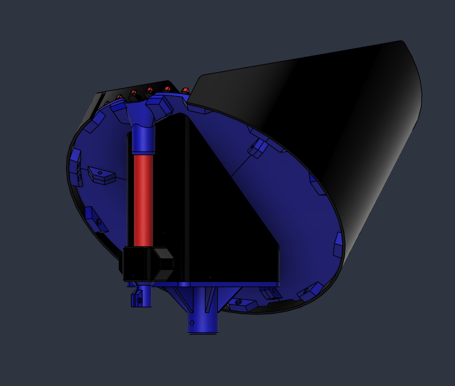
  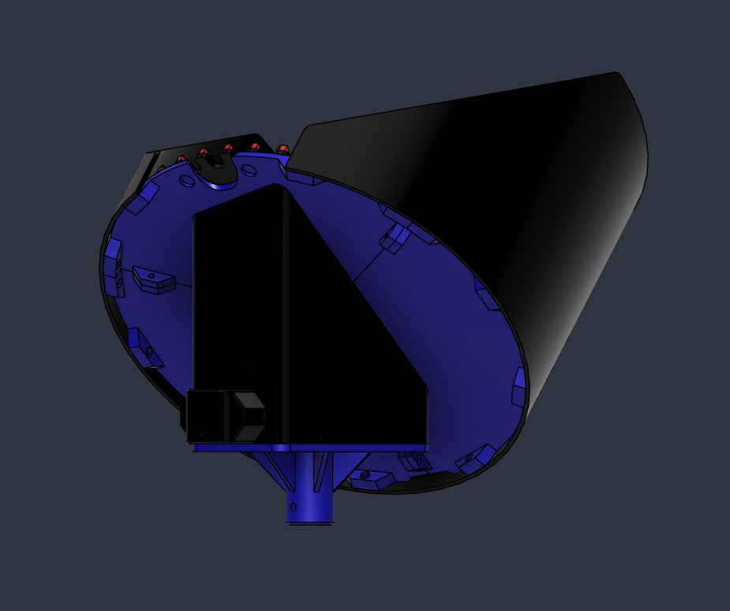
</p>

### Bullet feeder

<p>
  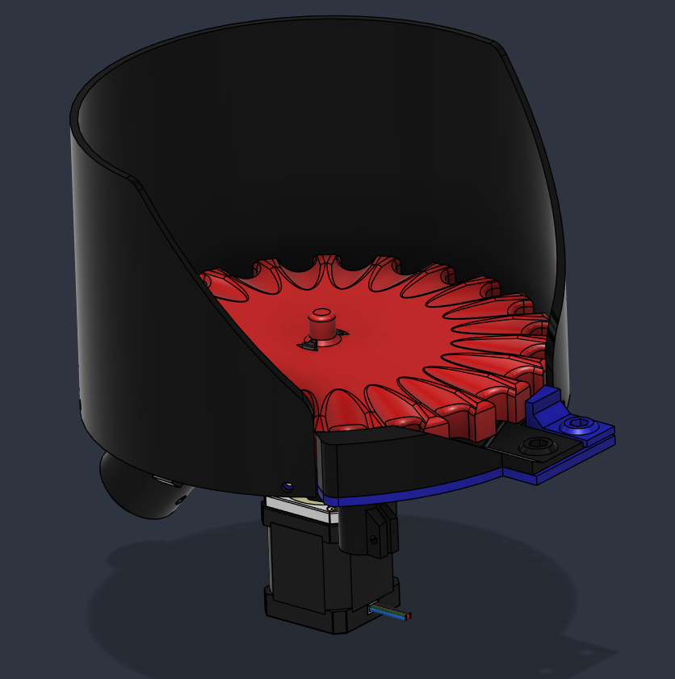
  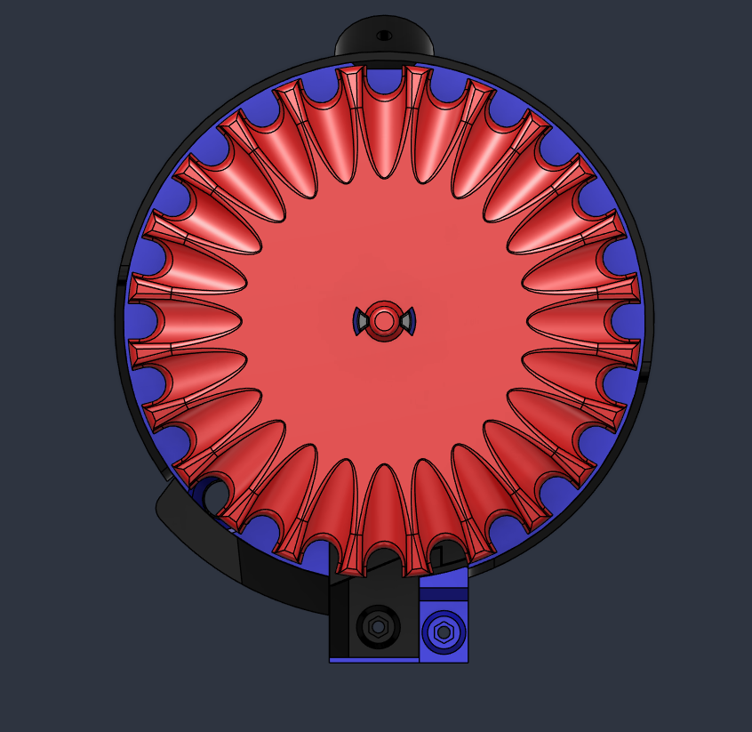
  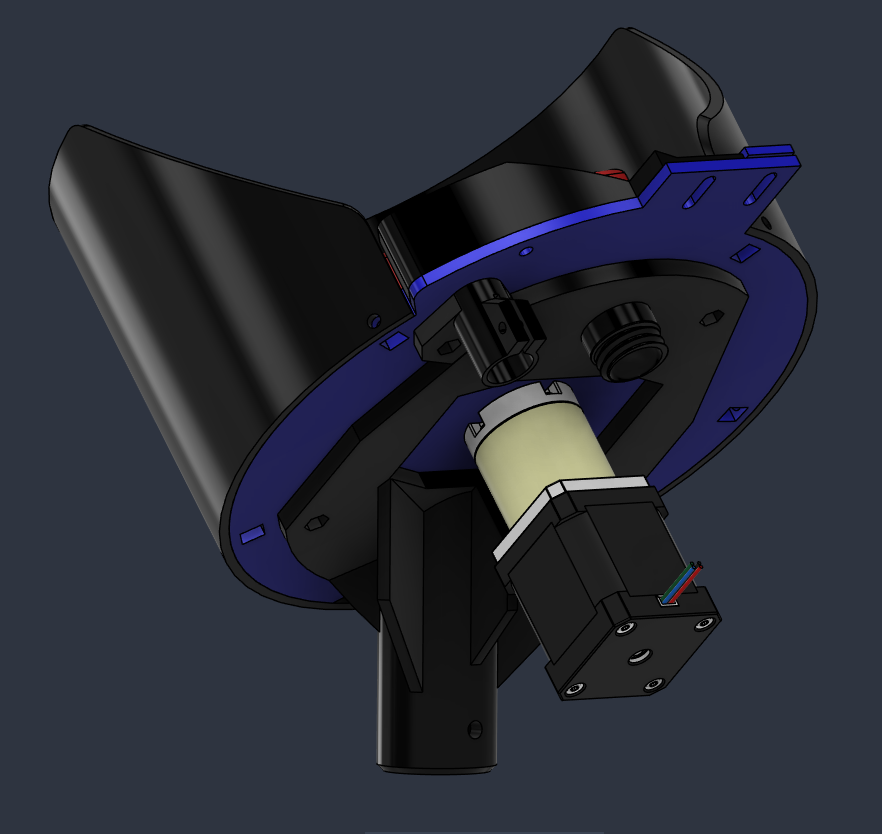
</p>

### Controller case

The SKR Pico and the touchscreen share one case, with the power switch,
power jack and driver fan on its end panel.

<p>
  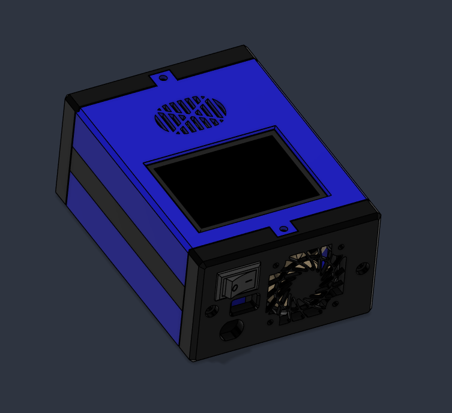
  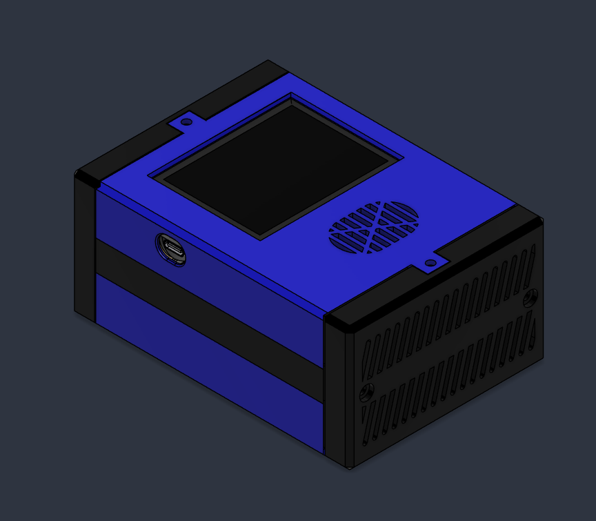
  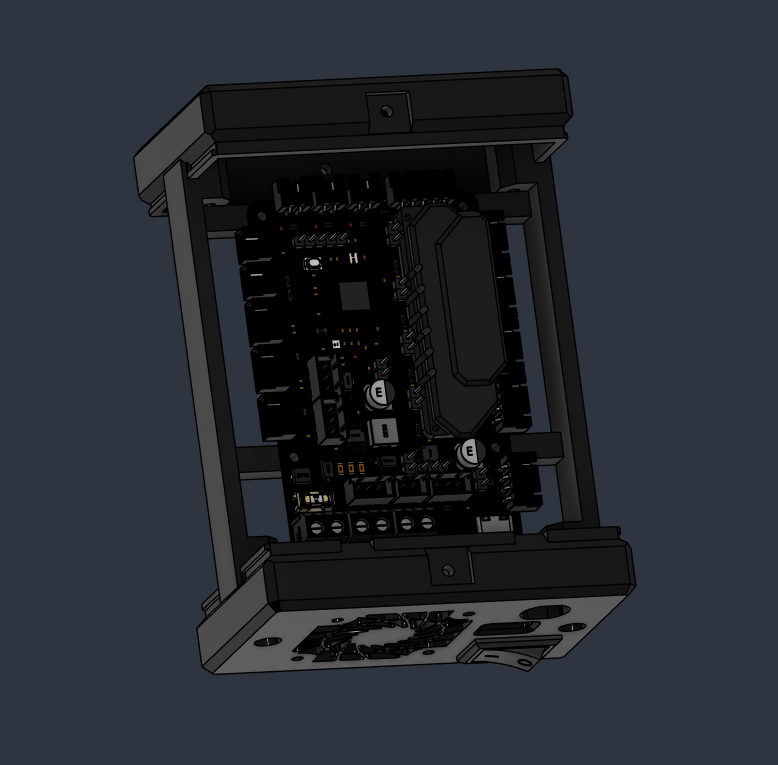
  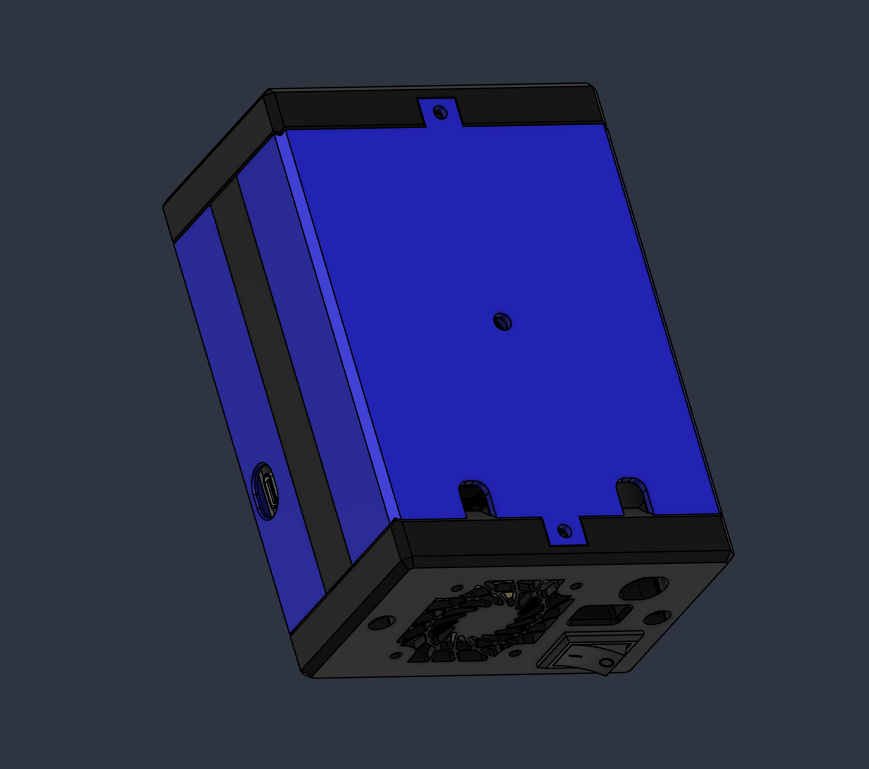
</p>

## Features

- **One firmware, three machines:** case feeder, bullet feeder, or dual
  (both). Choose on the touchscreen; no rewiring, since each feeder has its
  own ports.
- **Beam hold:** the motor stops while a part waits at the sensor and restarts
  when it is taken.
- **Jam detection and recovery:** sensorless stall detection (TMC2209
  StallGuard) reverses the plate to clear a jam, then feeds forward again. A
  jam that returns right away stops the feeder and raises an alarm.
- **Empty warning and auto shutoff** when nothing has fed for a while.
- **Five speed presets** per feeder, a live parts-per-hour rate, board
  temperature and motor-driver temperature alerts.
- **Independent feeders:** in dual mode a jam or stop on one never affects
  the other.
- The feeders keep running if the touchscreen is unplugged.

## Getting started

- [Build guide](docs/BUILD_GUIDE.md): wiring, flashing, first setup and
  daily use.
- [Parts list](docs/PARTS_LIST.md)
- [Printed parts](docs/PRINTED_PARTS.md): STL files for the feeders and the controller case

Both firmware images build with [PlatformIO](https://platformio.org/):

```
pio run -e controller -t upload
pio run -e lcd -t upload
```

## Repository layout

| Path | Contents |
|---|---|
| `src/controller.cpp` | controller firmware (SKR Pico) |
| `src/lcd_terminal.cpp` | touchscreen firmware (ESP32-S3) |
| `src/feeder_protocol.h` | the UART protocol shared by both |
| `src/*.h` | display, touch, audio and LVGL configuration for the touchscreen |
| `lib/FT6336/` | touch controller driver |
| `docs/` | build guide, parts list and printed parts |
| `stl/` | 3D-printable parts, one folder per assembly |

## License

GNU General Public License v3.0. See [LICENSE](LICENSE).
