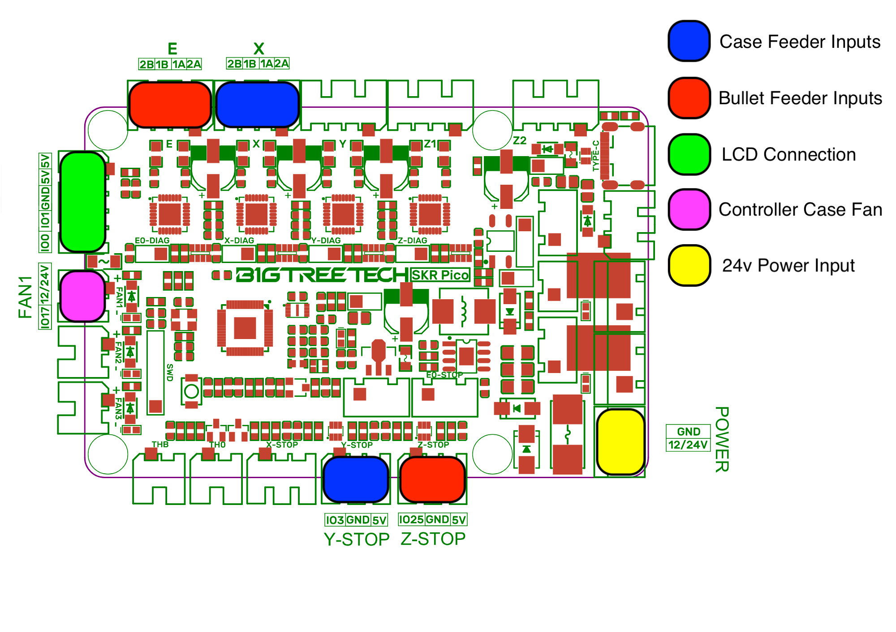

# Build guide

This guide covers wiring the controller and touchscreen, flashing the
firmware, first setup, and day-to-day use. For the parts, see the
[parts list](PARTS_LIST.md).

1. [How it fits together](#how-it-fits-together)
2. [Controller wiring](#controller-wiring)
3. [Touchscreen wiring](#touchscreen-wiring)
4. [Flashing the firmware](#flashing-the-firmware)
5. [First setup](#first-setup)
6. [Using the feeder](#using-the-feeder)
7. [Serial commands](#serial-commands)
8. [Adjusting jam detection](#adjusting-jam-detection)
9. [Troubleshooting](#troubleshooting)

---

## How it fits together

- The **controller** (BTT SKR Pico V1.0) runs everything that moves: the
  feeder motors, the part sensors, jam detection and the saved
  settings. It runs a **case feeder**, a **bullet feeder**, or **both**.
- The **touchscreen** (LCDWiki ES3C28P) connects to the controller with a
  4-wire cable. It shows each feeder, sends your commands, and plays the
  alert sounds. The feeders keep running if it is unplugged.
- Each feeder has **fixed ports** on the controller. Which feeders the
  controller runs is the **Machine** setting, chosen on the touchscreen, so
  you never rewire to change it.

## Controller wiring



*Board drawing based on the BigTreeTech SKR Pico V1.0 pin diagram.*

### Ports

| What | SKR Pico connector | Notes |
|---|---|---|
| 24 V supply | **POWER** screw terminal | +24 V to `12/24V`, 0 V to `GND` |
| Case feeder motor | **X** motor connector | |
| Case feeder sensor | **Y-STOP** (`IO3 / GND / 5V`) | see [Part sensors](#part-sensors) |
| Bullet feeder motor | **E** motor connector | |
| Bullet feeder sensor | **Z-STOP** (`IO25 / GND / 5V`) | see [Part sensors](#part-sensors) |
| Touchscreen | **Raspberry Pi UART** connector, 5-pin (`5V 5V GND IO1 IO0`) | see [Touchscreen wiring](#touchscreen-wiring) |
| Driver fan | **FAN1** | a **24 V** fan; FAN1 switches the 24 V input. Required when running two feeders |
| Status light (optional) | **RGB** header (`GND / IO24 / 5V`) | a WS2812 LED; it mirrors the on-board RGB LED |
| USB-C | USB-C socket | flashing and the serial console |

Only wire the feeders you have: a case-only build uses X and Y-STOP, a
bullet-only build uses E and Z-STOP.

### Connectors and cables

The SKR Pico uses **JST-XH (2.54 mm pitch)** connectors: 4-pin on the motor
ports, 3-pin on the STOP and RGB ports, 2-pin on FAN1, and 5-pin on the Pi
UART connector for the touchscreen. Most of the parts do not
come with matching plugs, so plan to make your own cables. A JST-XH kit with
pre-crimped wires (see the [parts list](PARTS_LIST.md)) avoids the need for a
crimp tool.

| Part | What it comes with | What to do |
|---|---|---|
| Stepper motors | Dupont 2.54 mm plugs | these fit the motor ports; check the coil pairs (see [Motors](#motors)) |
| Driver fan | 2-pin JST-XH plug | plugs straight into FAN1 |
| Break-beam sensor | JST-XH plugs; one may be 2-pin | re-pin a 2-pin plug into a 3-pin housing to match the STOP connector |
| TCRT5000 IR sensor | header pins, no wires | make a 3-wire cable with a 3-pin JST-XH plug for the STOP connector |
| Touchscreen | a cable with a small 4-pin plug on the screen end and Dupont connectors on the other | re-pin the Dupont end into a 5-pin JST-XH housing for the Pi UART connector (one `5V` position stays empty), and add the series resistors (see [Touchscreen wiring](#touchscreen-wiring)) |

### Jumpers

Every board is jumpered the same way, whatever the machine:

| Jumper | Setting | Why |
|---|---|---|
| **X-DIAG** | **fitted** | connects the case motor driver's stall signal to X-STOP |
| **E0-DIAG** | **fitted** | connects the bullet motor driver's stall signal to E0-STOP |
| **Y-DIAG** | **removed** | would connect an unused driver to the case sensor input |
| **Z-DIAG** | **removed** | would connect an unused driver to the bullet sensor input |
| BOOT | only for the first flash | see [Flashing the firmware](#flashing-the-firmware) |

Leave the X-STOP and E0-STOP connectors themselves empty; with the jumpers
fitted they carry the stall signal.

### Motors

The motor connectors are printed `2B 1B 1A 2A`. The motor's two coils go on
**adjacent pins**: one coil on `2B`+`1B`, the other on `1A`+`2A`. If a motor
buzzes or shudders without turning, its coil pairs are wrong. If it turns
the wrong way, don't rewire; set the direction in software (see
[First setup](#first-setup)).

The motor current is fixed in the firmware at 0.95 A.

### Part sensors

Each feeder has one sensor at its outlet that sees each part go by. Two
types are used; both are 3-wire 5 V sensors. The case feeder uses the
break-beam sensor; the bullet feeder uses the IR sensor.

| Sensor type | Wiring to the feeder's STOP connector |
|---|---|
| **IR sensor** (one unit) | signal to `IO`, `5V`, `GND` |
| **Break-beam** (emitter + receiver) | **receiver**: signal to `IO`, `5V`, `GND`. **Emitter**: `5V` and `GND` only, shared with the receiver on the same connector |

The case feeder's sensor goes on **Y-STOP** (`IO3`), the bullet feeder's on
**Z-STOP** (`IO25`). The firmware calls the sensor the *beam*: "beam
blocked" means the sensor sees a part.

By default the firmware expects the signal to read **LOW while a part is
there**. A sensor that works the other way is set with one command during
[First setup](#first-setup).

## Touchscreen wiring

| SKR Pico Pi UART connector | Touchscreen UART connector |
|---|---|
| `5V` | `5V` |
| `GND` | `GND` |
| `IO0` (controller TX) | `GPIO44` (screen RX) |
| `IO1` (controller RX) | `GPIO43` (screen TX) |

- Wire the data lines **by GPIO number**. The printed labels on some
  display boards are reversed; if the screen shows **NO LINK**, swap the two
  data wires.
- Fit a **470 Ω resistor in series with each data wire**.
- **Twist each data wire with its own ground wire**, keep the cable short,
  and route it away from the motor cables.
- Clip a **ferrite core** onto the cable near the touchscreen.

## Flashing the firmware

### Software

1. Install [Visual Studio Code](https://code.visualstudio.com/) and its
   **PlatformIO IDE** extension.
2. Open this repository's folder in VS Code. PlatformIO downloads the
   toolchains and libraries on the first build.

Commands below are run in the PlatformIO terminal from the repository folder.

### Controller (SKR Pico)

1. Connect the SKR Pico to the computer with USB-C. **Unplug the
   touchscreen's USB cable** while you do this: with both boards connected,
   the upload can send its reset to the touchscreen instead of the SKR Pico.
2. **First flash only:** fit the **BOOT** jumper and press the reset button.
   The board appears as a USB drive named `RPI-RP2`.
3. Run:
   ```
   pio run -e controller -t upload
   ```
4. **First flash only:** remove the BOOT jumper and press reset.

After the first flash, the upload command resets the board into its
bootloader by itself; no jumper is needed.

### Touchscreen (ESP32-S3)

1. Connect the touchscreen to the computer with USB-C.
2. Run:
   ```
   pio run -e lcd -t upload
   ```
3. If the upload cannot connect, hold the board's **BOOT** button, press
   **RESET**, release BOOT, and run the command again.

### Serial console

Both boards print status over USB at 115200 baud:

```
pio device monitor -e controller
pio device monitor -e lcd
```

Type a command and press Enter. On the controller, `?` prints the full
status; on the touchscreen, `?` prints its link and screen state.

## First setup

Do this once per controller, with the plates empty.

1. **Power up.** Turn on 24 V. The controller's RGB LED is dim white when
   ready. The touchscreen shows a feeder screen; the bottom bar should read
   `LINKED` or a feeder state, not `NO LINK`.
2. **Choose the machine.** On the touchscreen, tap the gear (Settings), then
   **press and hold** the **Machine** button. Pick **CASE**, **BULLET** or
   **DUAL**; the popup shows the wiring that choice expects. Tap **APPLY**.
   The screen changes to match within a second. A new board starts as DUAL.
3. **Check the motor drivers.** Open the controller's serial console and
   send `?`. Each feeder should show `driver: ready, DIAG in use`. If it
   shows `DIAG NOT used`, that feeder's DIAG jumper is missing.
4. **Check each sensor.** Send `e 1` (beam log on), then block and unblock
   each sensor by hand. You should see `C BEAM broken` / `C BEAM cleared` for
   the case feeder and `B BEAM ...` for the bullet feeder. If a sensor reports
   *broken* when you unblock it, select that feeder (`U 0` case, `U 1`
   bullet) and send `N 1`. Send `e 0` when done.
5. **Check each motor's direction.** Tap **GO** for one feeder and watch the
   plate. If it turns the wrong way, tap **STOP**, select that feeder
   (`U 0` / `U 1`) and send `M 1`. Repeat for the other feeder.
6. **Test jam recovery.** Load the feeder and run it. Hold the plate by hand
   for about a second: the feeder should back up, pause, and feed forward
   again. Hold it again straight away: it should stop with a **STALL** popup
   and an alarm. Tap **RESUME**.

The machine, beam polarity, motor direction, feed speeds and empty-warning
times are saved on the controller. Alerts, volume, screen flip and the last screen
layout are saved on the touchscreen.

## Using the feeder

### The screen

**One feeder** (CASE FEEDER PRO or BULLET FEEDER PRO):

- **FEED SPEED:** tap a preset (20, 40, 60, 80, 100 %).
- **CASES/HR** (or BULLETS/HR): the live feed rate. Press and hold to reset
  it.
- **TEMP:** the controller board's temperature.
- **GO / STOP:** starts and stops the feeder.
- **Bottom bar:** the feeder's state, the most urgent message, and the
  firmware version.

**Two feeders** (DUAL FEEDER PRO): the left half is the case feeder, the
right half the bullet feeder. Each half has its state, a **FEED SPEED**
stepper (`-` / `+` move between the presets), the live rate (press and hold
to reset) and its own **GO / STOP**. The top bar shows the board
temperature and Settings; the bottom bar shows the link and the most urgent
message from either feeder. Popups name the feeder they belong to.

Each feeder remembers its last speed and starts there after power-up (60 %
on a new controller).

### What the feeder does on its own

- **Beam hold:** when a part sits at the sensor, the motor stops (state
  `CASE HOLD` / `ROUND HOLD`) and restarts once the part is taken.
- **Jams:** when the motor stalls, the feeder reverses for about 2 seconds,
  pauses, then feeds forward again (state `JAM`).
- **Repeat jam:** if it jams again within 2 seconds of a recovery, it stops
  in **FAULT** with a **STALL** popup and an alarm. Clear the jam, then tap
  **RESUME**, or block that feeder's sensor twice within 2 seconds.
- **Empty warning:** if nothing has fed for the warning time (30 s by
  default), a popup and a chime say the feeder is empty. It keeps running,
  and the popup clears itself when parts flow again.
- **Auto shutoff:** after 2 minutes with nothing fed, the feeder stops
  (`IDLE`). Reload, then tap **RESUME** or block the sensor twice.
- **Driver temperature:** popups warn as a motor driver passes 120, 143,
  150 and 157 °C, and if it shuts itself off. Check the fan.

### Settings

Tap the gear in the top bar.

| Setting | What it does |
|---|---|
| Alerts | sounds on or off |
| Early warn (Case warn / Bullet warn) | empty-warning time, 15 to 90 s |
| Flip screen | turns the display 180° |
| Machine (press and hold) | CASE, BULLET or DUAL; only while every feeder is stopped |
| Volume | low, medium, high |

### Status light

The controller's RGB LED (and an optional external WS2812) shows the most
urgent feeder:

| Light | Meaning |
|---|---|
| green, steady | running |
| amber, slow blink | part waiting at the sensor |
| orange, fast blink | clearing a jam |
| blue, blinking | auto shutoff (empty) |
| red, flickering | FAULT |
| dim white | stopped, ready |
| red, 1 s blink | a motor driver is not answering (24 V off?) |

## Serial commands

Commands are a letter, a space, and a value (for example `U 1`), followed by
Enter. Feeder commands apply to the **selected** feeder; select it with `U`.

### Setup (saved)

| Command | What it does |
|---|---|
| `?` | full status |
| `K 1` / `K 2` / `K 3` | machine: case / bullet / dual (every feeder stopped first) |
| `U 0` / `U 1` | select the case / bullet feeder for the commands below |
| `R 1` / `R 0` | run / stop the selected feeder |
| `N 0` / `N 1` | sensor reads LOW / HIGH when a part is there |
| `M 0` / `M 1` | motor direction normal / reversed (feeder stopped) |

### Advanced (not saved; reset at power-up)

| Command | What it does |
|---|---|
| `t 1` / `t 0` | telemetry: StallGuard reading, speed and state twice a second |
| `e 1` / `e 0` | log every sensor block and clear |
| `j 1` / `j 0` | jam detection on / off |
| `s <n>` | set every jam threshold of the selected feeder to `n` (trips below `2 x n`) |
| `v <hz>` / `V <hz>` | maximum / minimum step rate (100 % / 0 % speed) |
| `b <ms>` / `B <ms>` | sensor time before a hold / clear time before resuming |
| `C <ms>` | sensor clear time before the next part counts |
| `w <ms>` | repeat-jam window (a jam within it is a FAULT) |
| `W <ms>` | how long a stall must last to count as a jam |
| `d <ms>` | settle time after speeding up before jams are checked |
| `g <hz>` | no jam checks below this step rate |
| `r <hz>` | reverse speed while clearing a jam |
| `o <ms>` / `i <ms>` | empty-warning / auto-shutoff time (0 = off) |
| `a` / `A` / `D <hz/s>` | acceleration / start-up acceleration / deceleration |
| `T` | simulate a jam (while running) |
| `F` | force a FAULT |

## Adjusting jam detection

Jam detection compares the motor driver's StallGuard reading with a
threshold for the current speed: the reading drops when the plate is
loaded, and a stall is flagged below **2 x threshold**. The built-in
thresholds suit the standard case and bullet feeders. If a feeder reports
jams that did not happen, or misses real ones, measure and adjust:

1. Select the feeder (`U 0` / `U 1`), turn jam detection off (`j 0`) and
   telemetry on (`t 1`).
2. Load the feeder and run it at the speed in question. Note the lowest
   `SG` value during normal feeding.
3. Hold the plate to make a jam and note the `SG` value while it is held.
4. Pick a threshold whose double (`trip<`) sits midway between the two
   numbers, set it with `s <n>`, turn detection back on (`j 1`) and test.

`s` is not saved. To keep a new value, edit `CASE_BANDS` or `BULLET_BANDS`
in `src/controller.cpp` (one threshold per speed range) and reflash the
controller.

## Troubleshooting

| Symptom | Check |
|---|---|
| Screen shows `NO LINK` / `CONTROLLER OFFLINE` | controller powered; swap the two data wires; 5V and GND connected |
| `CHECK DRIVER`, or the LED blinks red once a second | 24 V on; the motor driver could not be configured |
| Motor buzzes but does not turn | motor coil pairs (see [Motors](#motors)) |
| Plate turns the wrong way | `M 1` for that feeder |
| Feeder never holds, or holds all the time | sensor wiring; sensor polarity (`N 0` / `N 1`); check with `e 1` |
| Jams are not detected | `?` shows `DIAG in use`; DIAG jumper fitted |
| Jams reported that did not happen, or real jams missed | [Adjusting jam detection](#adjusting-jam-detection) |
| Machine **APPLY** is greyed out | stop every feeder first |
| Screen is upside down | Settings > Flip screen |
